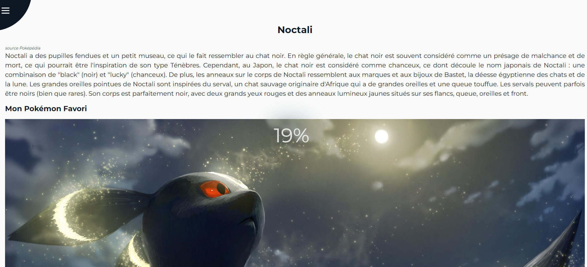
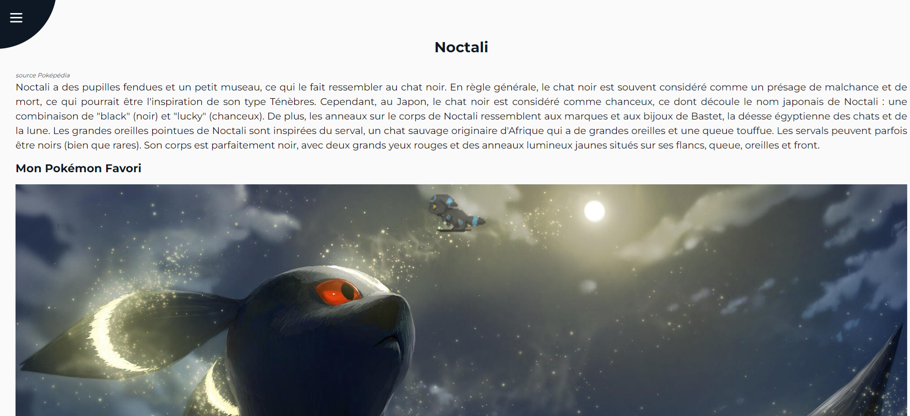

# :flower_playing_cards: Blurry Loading

Ce projet a été réalisé dans le cadre d'une formation sur [Udemy](https://www.udemy.com/course/50-projects-50-days/) afin de m'améliorer en JavaScript. Le but est de faire un projet par jour. J'ai décidé de me lancer un défi plus grand : faire un projet par jour mais en l'améliorant au lieu de simplement suivre les consignes données.

## Fonctionnalités

- **Animation de Chargement :** Ajout d'une animation au chargement de la page avec un compteur de pourcentage. Une fois le chargement terminé, un gif représentant Noctali Shiny en train de courir est affiché.
- **Interdiction des Interactions :** Aucune interaction n'est possible sur la page tant que l'animation de chargement n'est pas terminée.

### Technologies Utilisées

#### Mon Projet

Ce projet est le Cinquième d'une série dans laquelle je me donne l'objectif de perfectionner mes compétences en JavaScript. Bien que basé sur un projet d'entraînement, j'ai apporté mes propres personnalisations afin de mieux maîtriser le concept tout en conservant l'essence originale du projet.

### Améliorations Apportées

- **Fusion de projets :** Plutôt que de réaliser des projets indépendants, j’ai choisi de fusionner certains d'entre eux lorsque c’est possible, pour créer des projets de plus en plus complexes.
- **Interactions Désactivées :** J’ai implémenté un overlay bloquant toutes les interactions avec la page tant que l’animation de chargement est visible, garantissant une meilleure expérience utilisateur.

##### Comment Exécuter le Projet Localement

1. Clonez ce référentiel sur votre machine locale :

bash
git clone https://github.com/votre-utilisateur/votre-repository.git

2. Accédez au dossier du projet :

bash
cd votre-repository

3. Ouvrez le fichier index.html dans votre navigateur pour voir le site.

